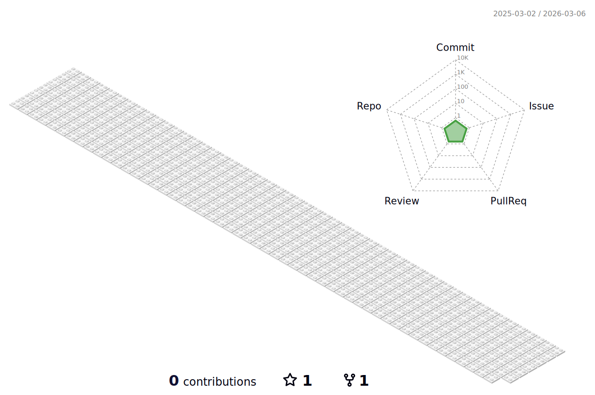

<!--   my-icons -->
<p align="center">
    <a href="https://github.com/BEPb/BEPb"></a>
    <a href="https://github.com/python/cpython"></a>
    <a href="https://github.com/BEPb/BEPb/graphs/contributors"></a>
    <a href="https://github.com/BEPb/BEPb/stargazers"></a>
    <a href="https://github.com/BEPb/BEPb/network/members"></a>
       
</p>

<!--   my-header-img -->

<a href="https://www.python.org/"></a>


<!--   my-ticker -->    
[](https://git.io/typing-svg)


<!--   my-kaggle     
### My achievements on [kaggle](https://www.kaggle.com/andrej0marinchenko):


-->


<!--   my-skils -->

| Property                                        | Data                                                                                                                                                                                                                                                                                                                                                                                                                                                                                                                                                                                                                                                                                                                                                                                                                                                                                                                                                                                                                                                                                                                                                                                                                                                                                                                                                                                                                                                                                                                                                                                                                                                                                                                                                                                                            |
|-------------------------------------------------|-----------------------------------------------------------------------------------------------------------------------------------------------------------------------------------------------------------------------------------------------------------------------------------------------------------------------------------------------------------------------------------------------------------------------------------------------------------------------------------------------------------------------------------------------------------------------------------------------------------------------------------------------------------------------------------------------------------------------------------------------------------------------------------------------------------------------------------------------------------------------------------------------------------------------------------------------------------------------------------------------------------------------------------------------------------------------------------------------------------------------------------------------------------------------------------------------------------------------------------------------------------------------------------------------------------------------------------------------------------------------------------------------------------------------------------------------------------------------------------------------------------------------------------------------------------------------------------------------------------------------------------------------------------------------------------------------------------------------------------------------------------------------------------------------------------------|
| **Language / IDE**                              |                                                                                                                                                                                                                                                                                                                                                                                                                                                                                                                                                                                                                                                                                                                                                                                                                                                                                                                                                                                                                                                                                                                                                                                                                                                                                                                                                                                                                                                                                                    |
| **Domain Knownledge**                           | [](https://github.com/BEPb/BEPb) [](https://github.com/BEPb/BEPb) [](https://github.com/search?q=user%3ABEPb&type=Repositories) [](https://github.com/search?q=user%3ABEPb&type=Repositories)                                                                                                                                                                                                                                                                                                                                                                                                                                                                                                                                                                                                                                                                                                                                                                                                                                                                                                                                                                                                                                                                                      |
| **CI / CD**                                     | [](https://github.com/BEPb/BEPb) [](https://github.com/BEPb/BEPb) [](https://github.com/BEPb/BEPb)                                                                                                                                                                                                                                                                                                                                                                                                                                                                                                                                                                                                                                                                                                                                                                                                                                                                                                                                                                                                                                                                                                                                                                                                                                                                                                                                                                                       |
| **Databases**                                   |                                                                                                                                                                                                                                                                                                                                                                                                                                                                                                                                                                                                                                                                                                                                                                                                                                                                                                                                         |
| **OS**                                          | <a target="_blank" rel="noopener noreferrer" href="https://camo.githubusercontent.com/b44114213a5a462903bd69611bb6846f1dc41fe6f3230bd37c67c3d4eb65f08c/68747470733a2f2f696d672e736869656c64732e696f2f62616467652f2d57696e646f77732d626c61636b3f7374796c653d666c61742d737175617265266c6f676f3d77696e646f7773266c6f676f436f6c6f723d626c7565"></a> <a target="_blank" rel="noopener noreferrer" href="https://camo.githubusercontent.com/9c4bc049e33f41f122342a1714ccf872c34098a9f2c593c33c2322cf0129fa04/68747470733a2f2f696d672e736869656c64732e696f2f62616467652f2d5562756e74752d626c61636b3f7374796c653d666c61742d737175617265266c6f676f3d7562756e7475"></a>                                                                                                                                                                                                                                                                           |
| **Tools & Platform**                            |                                                                                                                                                                                                                                                                                                                                                                                                                                                                                                                                                                                                                                                                                                                                                                                                                                                                                                                                                                                                                                                                                                                                                                                                                                                                                                                                                                                               |
| **Machine Learning / Deep Learning frameworks** |    |

<!--   GitHub stats graph -->
### 📈 GitHub Activity Graph:
<!-- [](https://github.com/BEPb/github-readme-activity-graph) -->

| .                                                                                                                                       | .                                                                                                                         |
|-----------------------------------------------------------------------------------------------------------------------------------------|---------------------------------------------------------------------------------------------------------------------------|
|  |  |

</img>

<!--   profile-green-animate -->


<!--   grid-snake -->


   <!--machine-learning-->
```mermaid
graph TD;
    machine-learning-->Data;
    machine-learning-->Algorithms;
    machine-learning-->Statistical-Models;
    machine-learning-->Feature-Engineering;
    machine-learning-->Evaluation-Metrics;
    machine-learning-->Deployment;
   ```
   


#### Thanks for visiting :heart:

<p align="center"> 
  

counting of visitors to this page in this section started from May 8, 2022
<a href="http://s01.flagcounter.com/more/ap7"></a>


## Star History

[](https://star-history.com/#BEPb/BEPb&Date)


### Profile Views
counting of visitors to this page in this section started from June 12, 2022


</br>

[MIT](LICENSE)


</p>

---
  *If you liked my profile, you can Star ⭐ the repo and if you want to use this template you can Fork it and can use.* 
---
Would you ike to meet me?

If you want to contribute to any of my repositories, feel free to submit PRs, issues and email me. Pick a slot if you'd like to meet me and chat about proposals and ideas - but make sure to describe the agenda

---
  *I use an automatic subscription control system. Thus, everyone who subscribes to me, I will subscribe to those and I will respond, and vice versa, I will remove all those who unsubscribe from me from among those who should be followed.* 
---


